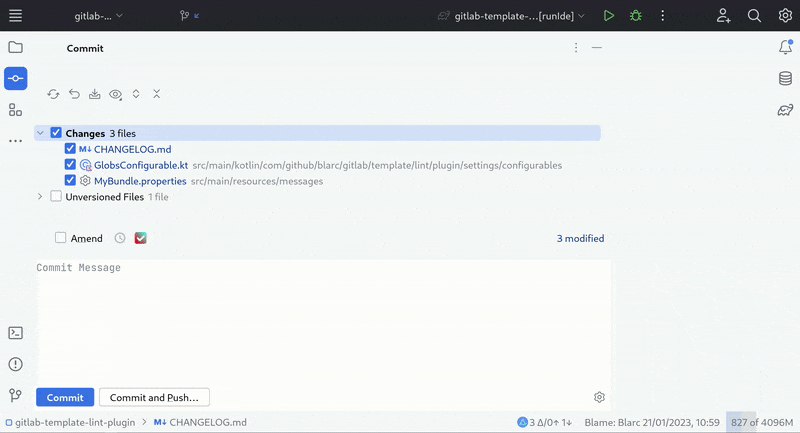

    

<h1 align="center">GitScribe</h1>

GitScribe for IntelliJ based IDEs/Android Studio.

 

- [Description](#description)
- [Features](#features)
- [Compatibility](#compatibility)
- [Install](#install)
- [Installation from zip](#installation-from-zip)

[//]: # (- [Demo]&#40;#demo&#41;)

## Description

GitScribe is a plugin that generates your commit messages by using git diff and LLMs. To get started, install the
plugin and configure a LLM API client in plugin's settings: <kbd>Settings</kbd> > <kbd>Tools</kbd> > <kbd>GitScribe</kbd>

## Features

- Generate commit message from git diff using LLM
- Compute diff only from the selected files and lines in the commit dialog
- Create your own prompt for commit message generation
- Use predefined variables and hint to customize your prompt
- Supports Git and Subversion as version control systems.

## Supported models

- Amazon Bedrock
- Anthropic
- Azure Open AI
- Claude Code (via CLI)
- Codex CLI (via CLI)
- Gemini Google AI
- Gemini Vertex AI
- GitHub Models
- Hugging Face
- Mistral AI
- Open AI
- Ollama
- Qianfan (Ernie)

The plugin is implemented in a generic way and uses [langchain4j](https://github.com/langchain4j/langchain4j) for creating LLM API clients. If you would like to use some other LLM model that is supported by langchain4j, please make a feature request in GitHub issues.

## Demo

<picture>
  <source media="(prefers-color-scheme: dark)" srcset="./screenshots/plugin-dark.gif">
  <source media="(prefers-color-scheme: light)" srcset="./screenshots/plugin-white.gif">
  
</picture>

## Compatibility

IntelliJ IDEA, PhpStorm, WebStorm, PyCharm, RubyMine, AppCode, CLion, GoLand, DataGrip, Rider, MPS, Android Studio,
DataSpell, Code With Me

## Install

Download a release build from GitHub, then install it from disk in your JetBrains IDE.

### Installation from zip

1. Download zip from [releases](https://github.com/allanwxl/GitScribe/releases)
2. Import to IntelliJ: <kbd>Settings</kbd> > <kbd>Plugins</kbd> > <kbd>Cog</kbd> > <kbd>Install plugin from
   disk...</kbd>
3. Set LLM client configuration in plugin's settings: <kbd>Settings</kbd> > <kbd>Tools</kbd> > <kbd>GitScribe</kbd>

[//]: # (## Demo)

[//]: # ()

[//]: # (![demo.gif]&#40;./screenshots/plugin2.gif&#41;)

## Support

* [Star the repository](https://github.com/allanwxl/GitScribe)

## Change log

Please see [CHANGELOG](CHANGELOG.md) for more information what has changed recently.

## Contributing

Please see [CONTRIBUTING](CONTRIBUTING.md) for details.

## Acknowledgements

- [openai-kotlin](https://github.com/aallam/openai-kotlin) for OpenAI API client.
- [langchain4j](https://github.com/langchain4j/langchain4j) for LLM API clients.

## License

Please see [LICENSE](LICENSE) for details.

## Star History

<a href="https://star-history.com/#allanwxl/GitScribe&Date">
 <picture>
   <source media="(prefers-color-scheme: dark)" srcset="https://api.star-history.com/svg?repos=allanwxl/GitScribe&type=Date&theme=dark" />
   <source media="(prefers-color-scheme: light)" srcset="https://api.star-history.com/svg?repos=allanwxl/GitScribe&type=Date" />
   
 </picture>
</a>
